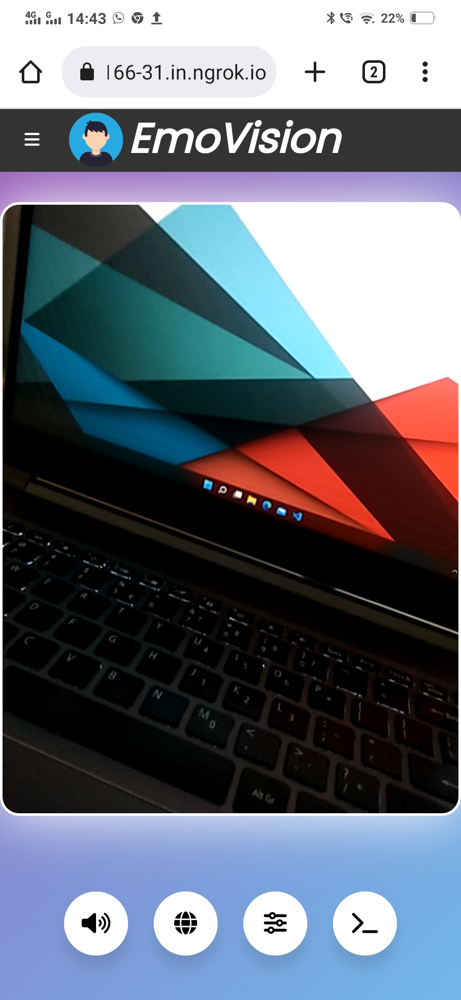

# EmoVision 

This app helps visually impaired person connect with their loved ones emotionally.

As a visually acute person, we take being able to know the emotion of our friends/family members emotions with their facial expressions for granted. This is not the case for visually impaired person. They have to guess others emotion by hearing, which can't be always known. This application helps them to remove that barrier.

This app is ease to access with big area (Cam Feed), where they can tap to know the emotion. Output is in form of audio or vibrator of device.

## Host Web Site 🌐

1. Download this repo: `git clone https://github.com/SurajValluru/EmoVision.git`

2. Navigatie to directory: `cd EmoVision`

3. Run `pip install -r requirements.txt`

This app was tested on Windows and Ubuntu WSL. Linux docker containers are not supported.

### Host locally ⬇️

Navigate to EmoVision directory

Run `python app.py` or `flask run`

The website will be up and running at `localhost:5000` by default.

To mention local ip address and port run `flask run --host=0.0.0.0 --port=80`

Required to be online to load complete page.

### Host globally 🌍

[ngrok](https://www.ngrok.com) can be used to expose localhost, globally.

I provided ngrok for windows in extras folder.

1. Navigate to extras directory: `cd extras`

2. Create a [ngrok](https://www.ngrok.com) account, run below command with received authtoken. This command should be run for the very first time only.

`./ngrok config add-authtoken <token>`

3. Run `./ngrok http 5000` command to expose `localhost:5000` server port 5000 to internet.

4. Use above generated link to open locally hosted website on any device with internet.

5. Once you cancel ngrok service and start again, new link is generated.

## Usage 🤖

Make sure that your surrounding is well-lit.

Tap on video to know the current emotion. Change output modes with bottom buttons.

By default, camera is set to rear camera.

Configurations:

- Custom vibration patterns
- Languages
- Camera

## Compatibility ⚙️

Compatible on Chromium based browsers like Google Chrome, Microsoft Edge, Brave.

Vibration feature is compatible only to Android versions of above browsers.

Thats the reason why few features are deprecated in desktop version.

Using mobile mode in desktop redirects to desktop version.

If opened in desktop inspection mode as a mobile, app doesn't give correct emotion results.

## Tech Stack 🧑‍💻

- [Flask](https://flask.palletsprojects.com/) Framework
- [OpenCV](https://opencv.org/) Tools
- Languages:
  - Python 3.10.4
  - JavaScript (V8 Engine)
